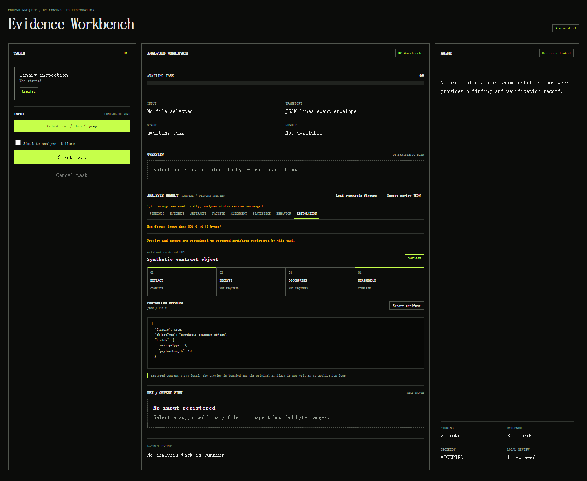

# Pre-teacher-data delivery evidence

This directory freezes the reproducible evidence that can be produced before the
authoritative teacher dataset is supplied. It contains no teacher data, answer key,
credential, private traffic, or claimed teacher-data metric.

## Scope and identity

- executable baseline: `347f2ff21819dfbff992074db2b67b51b4599efc`;
- application version: `0.1.0`;
- synthetic mechanism dataset: `synthetic-mechanism-v1`;
- dataset SHA-256: `5eaaf0f216085bdec25998ccd20f3e4242466375158f350740995494c7d8bc3e`;
- result scope: `mechanism`;
- formal teacher benchmark: `false`;
- real-LLM quality benchmark: `false`.

The final source tag is created only after the delivery PR passes the repository's
current-version CI gate and is merged. The tag target and exact merge SHA are then
recorded in GitHub Issue #99.

## Contents

- `mechanism/` contains fresh canonical records for the heuristic and naive-vote
  controls, the full EvidenceGraph-PRE mechanism, LLM-only and LLM+verification
  baselines, no-LLM/no-verification/no-provenance/no-alignment ablations, and the
  fixed 9-point fusion-threshold grid.
- `synthetic-analysis/` preserves the Sidecar `tasks/task-demo/` result-reference
  layout from the packaged Sidecar's same-interface 76-byte synthetic `.dat`
  rehearsal. The raw `.dat` is intentionally not committed.
- `ui-headless-edge.png` records the Edge presentation state used to exercise all
  eight result views and the evidence-to-offset navigation path.
- `review-export.json` is the bounded local-review export produced by that UI path.
- `SHA256SUMS.txt` identifies every frozen evidence file in this directory.



## Fresh mechanism results

| Variant | Schema executable | ParseCoverage | Constraint satisfaction | Important observation |
|---|---:|---:|---:|---|
| `heuristic` | yes | 1.0 | 1.0 | deterministic control |
| `naive_vote` | yes | 1.0 | 1.0 | equal-source vote control |
| `ablation_no_llm` | yes | 1.0 | 1.0 | production deterministic path |
| `llm_only` | yes | 1.0 | not evaluable | selected the deliberately high-confidence wrong hypothesis |
| `llm_verification` | no | 0.0 | 0.0 | verifier rejected the wrong hypothesis, then global selection abstained on unresolved overlap |
| `evidencegraph_pre` | yes | 1.0 | 1.0 | rejected one deliberately wrong hypothesis and selected one verified field |
| `ablation_no_provenance` | yes | 1.0 | 1.0 | mechanism-only ablation |
| `ablation_no_verification` | yes | 1.0 | not evaluable | no executable verification by design |
| `ablation_no_alignment` | yes | 1.0 | 1.0 | alignment evidence removed while preprocessing remained fixed |

The threshold grid kept the production decision and selected range at 6 of 9 fixed
points. The three points with acceptance support `0.85` abstained and produced no
schema. The harness does not select an optimum from synthetic data.

These figures test mechanism execution and fail-closed behavior only. Packet/field
F1, semantic accuracy, restoration accuracy, risk coverage, supervised behavior
metrics, and any real-model quality/cost comparison remain unavailable until the
required teacher data or ground truth exists.

## Reproduction

Run from a clean checkout with Python 3.10 or 3.11 and substitute the checkout's
40-character commit SHA:

```powershell
python scripts/run_synthetic_mechanism_experiments.py --outdir <output> --code-sha <sha>
python scripts/run_full_evidencegraph_mechanism_experiment.py --outdir <output> --code-sha <sha>
python scripts/run_llm_only_mechanism_baseline.py --outdir <output> --code-sha <sha>
python scripts/run_llm_verification_mechanism_baseline.py --outdir <output> --code-sha <sha>
python scripts/run_no_provenance_ablation.py --outdir <output> --code-sha <sha>
python scripts/run_no_verification_ablation.py --outdir <output> --code-sha <sha>
python scripts/run_no_alignment_ablation.py --outdir <output> --code-sha <sha>
python scripts/run_threshold_sensitivity_analysis.py --outdir <output> --code-sha <sha>
```

The authoritative teacher-data procedure remains in
[`docs/teacher-data-ingress.md`](../../docs/teacher-data-ingress.md).
